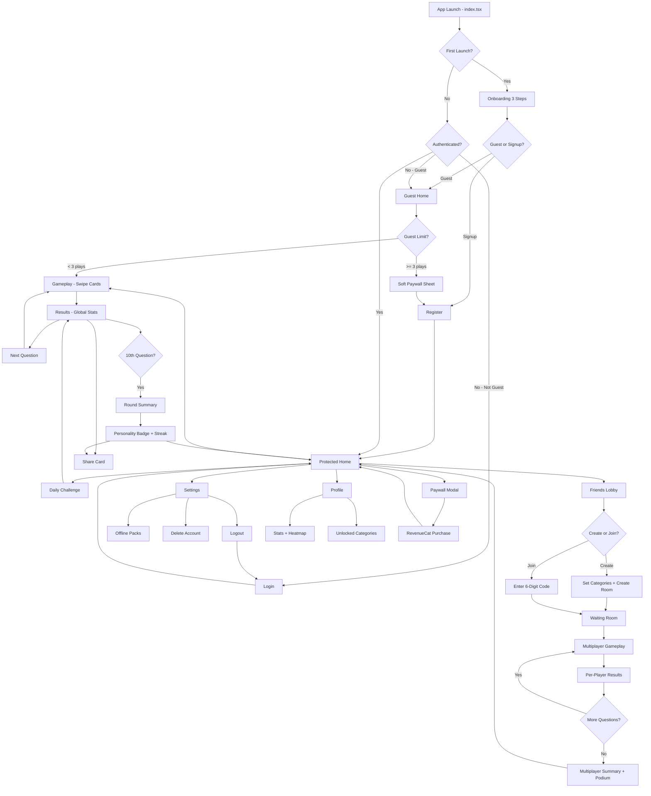

# WouldYou — Master Specification

> The party game that never runs out of questions

Generated: 2026-02-14T12:53:17.556133+00:00 | Pipeline v1.0.0

## 1. App Overview

**Name:** WouldYou
**Tagline:** The party game that never runs out of questions
**Description:** WouldYou is a social party game featuring AI-generated Would You Rather questions with unlimited variety. Players see real-time global voting stats after each choice, creating viral 'wait, really?!' moments. Free to play with zero paywalls blocking access — premium unlocks themed packs and private friend lobbies.
**Target Audience:** College students and young adults (18-28) who play party games at gatherings, pregames, and hangouts. Values fun over polish, shares results on social media.
**Differentiator:** Only WYR app combining AI-generated infinite questions with free friend lobbies and viral share cards. Competitors either paywall multiplayer ($10/month) or have repetitive fixed question sets. WouldYou solves both problems simultaneously.
**Feasibility:** moderate (10 days)
**Confidence:** 85%

## 2. Tech Stack (Fixed)

- **Mobile:** Expo SDK 54 + React Native 0.81 + NativeWind v4 + Expo Router v6
- **Backend:** Go-Fiber v2 + GORM + PostgreSQL
- **Auth:** JWT + Sign in with Apple
- **Payments:** RevenueCat
- **Deployment:** Coolify PaaS
- **Ci Cd:** EAS Build + Fastlane

## 3. Core Features

1. AI-generated Would You Rather questions using GLM-5 API with category filters (funny, deep, spicy, gross)
2. Global voting stats revealed after each answer — see what percentage of players chose each option
3. Free private friend lobbies via shareable 6-digit room codes (no subscription required)
4. Swipe-based gameplay — swipe left or right to choose, with haptic feedback on selection
5. Daily viral question — one curated question per day shown to all users with global leaderboard
6. Share cards — auto-generated Instagram Story / TikTok-ready images showing your answer vs global stats
7. Streak system — consecutive daily plays unlock exclusive question categories
8. Offline mode with cached question packs for airplane/road trip play

## 4. Market Research

**Market Size:** TAM estimated at 50-100M+ globally based on combined download figures (one app alone claims 5M+ downloads, top competitor has 207K+ reviews which typically represents 1-5% of downloads). SAM for English-speaking markets estimated at 20-40M. Market is mature but fragmented with no dominant player.
**Sentiment:** negative (2.5/5)
**Competitors:** 7
**Trends:** AI-generated questions for endless variety - developers actively shipping this in 2025, Subscription fatigue - users increasingly frustrated with weekly fees ($4.99-$10/week), All-in-one party game apps combining WYR, Truth or Dare, Never Have I Ever

### Pain Points

- **Aggressive subscription paywalls blocking app access entirely - users can't even open apps without starting a trial or paying** (severity: 9/10, freq: 8/10)
- **Hidden/unwanted subscription charges and billing issues - users being charged even after cancelling** (severity: 10/10, freq: 7/10)
- **Excessive ads disrupting gameplay experience** (severity: 6/10, freq: 6/10)
- **App crashes and technical bugs making games unplayable** (severity: 8/10, freq: 5/10)
- **Repetitive/boring questions lacking variety and humor compared to physical card versions** (severity: 5/10, freq: 5/10)

### Competitors

| App | Rating | Reviews | Price | Strengths | Weaknesses |
|-----|--------|---------|-------|-----------|------------|
| What Would You Choose? Rather | 4.6 | 207,976 | freemium | Massive user base, High rating | Too many ads per user reviews, Removed access to paid version for long-time users |
| Party Roulette: Group games | 4.6 | 80,378 | freemium | Strong brand recognition, Good for drinking/party context | Billing issues reported, Aggressive subscription tactics |
| Picolo · Party game | 4.7 | 44,469 | freemium | Highest rating, Team and solo play options | $4.99/week subscription considered 'ridiculous', Billing complaints |
| Would You Rather? Adult | 4.6 | 18,107 | freemium | Good for adult parties, Similar to other party games | Generic offering, Subscription fatigue |
| Bunch is MiniParty! | 4.1 | 13,878 | freemium | Cross-platform (phone/laptop), Built-in chat | Very buggy, Crashes frequently |
| Would You Rather? Dirty Adult | 4.6 | 7,322 | freemium | Adult-focused niche, Party/college audience | Forced subscription to even open app, Less fun than card version |
| Would You Rather? Viral Game | 4.3 | 1,461 | freemium | 5M+ downloads claimed, Social network features | Crashes every 3-5 questions, Smaller review base |

## 5. Design System

**Style:** Playful-Modern with AI Gradient Haze and OLED Deep Dark. Combines vibrant Gen Z energy with sophisticated glassmorphism. Bold typography for question readability, haptic-visual feedback loops, and bento-grid stat displays create shareable viral moments.

### Colors

| Token | Hex | Usage |
|-------|-----|-------|
| primary | `#FF6B9D` | Primary brand color, choice A indicators, active states, CTA buttons |
| secondary | `#00D4AA` | Secondary brand color, choice B indicators, success states, positive stats |
| accent | `#FFE66D` | Highlights, streak flames, daily badge, attention-grabbing elements |
| background | `#0A0A12` | OLED-optimized deep background, main screen backdrop |
| surface | `#1A1A2E` | Card backgrounds, elevated surfaces, glassmorphism base layer |
| surface_glass | `#2A2A4A` | Glassmorphism overlay with 60% opacity for question cards |
| text_primary | `#FFFFFF` | Main text on dark backgrounds, question text, headings |
| text_secondary | `#B8B8D0` | Secondary text, descriptions, metadata, timestamps |
| text_muted | `#6B6B8A` | Disabled states, placeholder text, less important info |
| gradient_haze_start | `#FF6B9D` | AI gradient haze start - creates atmospheric background glow |
| gradient_haze_mid | `#C44DFF` | AI gradient haze middle - purple transition for dreamy effect |
| gradient_haze_end | `#00D4AA` | AI gradient haze end - teal for dynamic movement |
| choice_a | `#FF6B9D` | Left swipe choice indicator, option A highlighting |
| choice_b | `#00D4AA` | Right swipe choice indicator, option B highlighting |
| streak_fire | `#FF9F43` | Streak counter accent, flame icon, engagement rewards |
| error | `#FF5757` | Error states, connection issues, moderation flags |
| overlay | `#000000` | Modal backdrop with 70% opacity for focus |

### Dark Mode Overrides

| Token | Hex | Usage |
|-------|-----|-------|
| background_light | `#F8F7FC` | Light mode main background |
| surface_light | `#FFFFFF` | Light mode card surfaces |
| text_primary_light | `#1A1A2E` | Light mode primary text |
| text_secondary_light | `#6B6B8A` | Light mode secondary text |
| gradient_light_start | `#FFB8D0` | Light mode gradient haze start - softer pink |
| gradient_light_end | `#B8FFF0` | Light mode gradient haze end - softer teal |

### Typography

- **question:** 26px bold, line-height: 1.3
- **heading1:** 28px bold, line-height: 1.2
- **heading2:** 22px semibold, line-height: 1.3
- **heading3:** 18px semibold, line-height: 1.4
- **body:** 16px normal, line-height: 1.5
- **body_bold:** 16px semibold, line-height: 1.5
- **stat_number:** 48px bold, line-height: 1.0
- **stat_percent:** 32px bold, line-height: 1.0
- **caption:** 14px normal, line-height: 1.4
- **micro:** 12px normal, line-height: 1.3
- **swipe_hint:** 14px medium, line-height: 1.0

### Component Styles

- **question_card:** radius=24px, padding=`p-6`, shadow=`shadow-xl` Glassmorphism card with blur-20 bg-white/10 border border-white/20, displays WYR question with swipe gestures
- **choice_button:** radius=16px, padding=`p-4`, shadow=`shadow-lg` 44x44px min touch target, haptic feedback on press, scales to 0.95 on active state
- **swipe_indicator:** radius=12px, padding=`px-4 py-2`, shadow=`` Left/right swipe hint overlays with choice_a/choice_b colors, fades during swipe
- **stats_card:** radius=20px, padding=`p-5`, shadow=`shadow-md` Bento grid layout for voting percentages, animated number reveal with spring animation
- **lobby_card:** radius=16px, padding=`p-4`, shadow=`shadow-md` Friend lobby item with 6-digit code display, player avatars in horizontal stack
- **share_card:** radius=24px, padding=`p-6`, shadow=`shadow-2xl` Instagram Story format (1080x1920), gradient background, question + user choice + global stats
- **category_pill:** radius=9999px, padding=`px-4 py-2`, shadow=`` Category filter chips (funny, deep, spicy, gross), active state with primary background
- **streak_badge:** radius=12px, padding=`px-3 py-1`, shadow=`shadow-sm` Fire icon + streak number, accent background, pulse animation on increment
- **daily_card:** radius=20px, padding=`p-5`, shadow=`shadow-xl` Featured daily viral question with gradient border accent and crown icon
- **modal_sheet:** radius=28px, padding=`p-6`, shadow=`shadow-2xl` Bottom sheet modal with drag handle, glassmorphism background, slides up from bottom
- **input_field:** radius=12px, padding=`p-4`, shadow=`` Custom question input, surface background with 1px border-white/10, 44px height
- **avatar_stack:** radius=9999px, padding=``, shadow=`` Overlapping player avatars -8px offset, ring border for current player turn

### Design Notes

- AI Gradient Haze: Animated gradient blobs (primary -> purple -> secondary) create atmospheric backgrounds that shift subtly during gameplay, reinforcing the AI-generated content theme
- OLED Deep Dark: True black (#0A0A12) background saves battery on OLED screens and makes vibrant choice colors pop dramatically
- Glassmorphism: Question cards use backdrop-blur with semi-transparent backgrounds, creating depth without losing readability
- Bento Grid: Stats reveal uses asymmetric grid layout - large percentage number (60%) with smaller secondary stats arranged around it
- Haptic-Visual Sync: Swipe animations are timed to match iOS/Android haptic feedback durations (100ms light impact), creating satisfying choice confirmation
- Touch targets: All interactive elements exceed 44x44px minimum - swipe area covers full card, buttons use p-4 minimum padding
- Color coding: Choice A (pink/left) vs Choice B (teal/right) creates instant visual recognition for swipe direction
- Accessibility: All text on dark backgrounds meets WCAG AA contrast ratio (4.5:1 for body, 3:1 for large text)
- Share cards use 9:16 aspect ratio optimized for Instagram Stories and TikTok, with gradient backgrounds matching app aesthetic
- Streak system uses fire icon with warm orange (#FF9F43) distinct from primary/secondary to create reward differentiation

## 6. UX Architecture

**Navigation:** custom-tabs

### Tab Bar

| Label | Icon | Route |
|-------|------|-------|
| Play | game-controller-outline | home |
| Daily | today-outline | daily-challenge |
| Friends | people-outline | friends-lobby |
| Profile | person-outline | profile |

### Screens

#### index
- **Route:** `app/index.tsx`
- **Description:** Smart router: checks AsyncStorage for onboarding completion, then auth state. Redirects to onboarding (first launch), guest-home (not logged in), or protected home (authenticated). No visible UI — just a full-screen spinner during redirect logic.
- **Components:** ActivityIndicator, useEffect redirect logic

#### onboarding-welcome
- **Route:** `app/(auth)/onboarding.tsx`
- **Description:** Step 1: Full-screen gradient background (#6C5CE7 → #A855F7). Centered illustration of two cards being swiped. Headline: 'Would You Rather...?' in 32px bold white. Subtext: 'The party game that never runs out of questions' in 16px white/70%. Bottom: 'Get Started' pill button (#FFFFFF bg, #6C5CE7 text). Three dot indicators at bottom showing step 1/3. Swipe right to advance.
- **Components:** LinearGradient, Animated.View (card illustration), StepIndicator (3 dots), PillButton

#### onboarding-features
- **Route:** `app/(auth)/onboarding.tsx`
- **Description:** Step 2 (same file, step state): Dark background (#1A1A2E). Three feature cards stacked vertically with icons: (1) Ionicons 'infinite-outline' + 'Endless AI Questions — Never play the same question twice' (2) Ionicons 'people-outline' + 'Free Friend Lobbies — No subscription, just a room code' (3) Ionicons 'share-social-outline' + 'Share Your Takes — Viral-ready cards for Stories & TikTok'. Cards have #2D2B55 background, 16px rounded corners, left icon 24px in #A855F7. Swipe right to advance.
- **Components:** FeatureCard (icon + title + subtitle), StepIndicator, LinearGradient

#### onboarding-cta
- **Route:** `app/(auth)/onboarding.tsx`
- **Description:** Step 3: Dark background (#1A1A2E). Centered large emoji 🎉. Headline: 'Ready to Play?' 28px bold white. Subtext: '3 free rounds — no account needed' 14px #ABABC0. Two buttons stacked: (1) 'Play as Guest' — outlined button, #A855F7 border, #A855F7 text, calls continueAsGuest() (2) 'Create Account' — filled #A855F7 button, white text, navigates to register. Below: 'Already have an account? Log in' text link in #ABABC0. Sets onboarding_complete in AsyncStorage.
- **Components:** PillButton (filled), PillButton (outlined), TextLink

#### login
- **Route:** `app/(auth)/login.tsx`
- **Description:** Dark background (#1A1A2E). Top: 'Welcome Back' 28px bold white + 'Log in to continue your streak' 14px #ABABC0. Email input (#2D2B55 bg, #FFFFFF text, placeholder #6B6B8D) with Ionicons 'mail-outline'. Password input (same style) with Ionicons 'lock-closed-outline' and show/hide toggle. 'Forgot Password?' text link right-aligned #A855F7. 'Log In' full-width pill button #A855F7. Divider '— or —' in #6B6B8D. Apple Sign In button (ASAuthorizationButton). Bottom: 'Don\'t have an account? Sign up' text link.
- **Components:** TextInput (email), TextInput (password), PillButton, AppleSignInButton, TextLink
- **API Calls:** POST /api/auth/login, POST /api/auth/apple

#### register
- **Route:** `app/(auth)/register.tsx`
- **Description:** Dark background (#1A1A2E). Top: 'Create Account' 28px bold white + 'Join 50K+ players worldwide' 14px #ABABC0. Email input, password input (with strength indicator bar — red/yellow/green), confirm password input. All inputs #2D2B55 bg. 'Create Account' pill button #A855F7. Divider. Apple Sign In button. Bottom: 'Already have an account? Log in' link. On success: auto-login + hapticSuccess() + confetti animation + redirect to protected home.
- **Components:** TextInput (email), TextInput (password), TextInput (confirm), PasswordStrengthBar, PillButton, AppleSignInButton, ConfettiAnimation
- **API Calls:** POST /api/auth/register, POST /api/auth/apple

#### guest-home
- **Route:** `app/(auth)/guest-home.tsx`
- **Description:** Same layout as protected home but with a persistent top banner: 'Guest Mode — X of 3 free plays remaining' in #FFA502 bg, black text, with 'Sign Up Free' link. When guestUsageCount >= 3, tapping Play shows a bottom sheet soft paywall instead of starting game. The daily question card is always visible and playable (no guest limit). Room join is disabled for guests (shows 'Create account to play with friends' tooltip).
- **Components:** GuestBanner, DailyQuestionCard, PlayButton, CategoryChips, SoftPaywallSheet
- **API Calls:** GET /api/questions/daily

#### home
- **Route:** `app/(protected)/home.tsx`
- **Description:** Main hub. Dark background (#1A1A2E). Top bar: left — streak flame icon 🔥 + streak count in #FFA502, right — settings gear icon. Below: Daily Question Card — special gradient card (#6C5CE7 → #A855F7) with 'DAILY CHALLENGE' badge, question text 18px white, 'X,XXX players today' counter, tap to play. Main section: 'Quick Play' large pill button (#A855F7, full width) with Ionicons 'play-outline'. Below: horizontal scroll of category filter chips (All, Funny 😂, Deep 🧠, Spicy 🌶️, Gross 🤢) — each is a rounded pill, selected = #A855F7 fill, unselected = #2D2B55 outline. Below: 'Play with Friends' button (#2D2B55 bg, #A855F7 text) with Ionicons 'people-outline'. Bottom: stats row — 'X questions answered' | 'X day streak' | 'Top X%'.
- **Components:** StreakBadge, DailyQuestionCard, PillButton (Quick Play), CategoryChipScroll, PillButton (Friends), StatsRow, CustomTabBar
- **API Calls:** GET /api/questions/daily, GET /api/users/me/stats, GET /api/streaks/current

#### gameplay
- **Route:** `app/(protected)/gameplay.tsx`
- **Description:** Full-screen swipe-based question card. Dark background (#0D0D1A). Center: large card (90% width, 60% height, 24px rounded, #2D2B55 bg) with gradient top border. Card content: 'Would You Rather...' 14px #A855F7 top label. Option A text (18px bold white) on top half. Divider line with 'OR' circle badge (#A855F7). Option B text (18px bold white) on bottom half. Swipe left = Option A (card tilts left, left edge glows #FF6B6B). Swipe right = Option B (card tilts right, right edge glows #4ECDC4). Haptic impact (medium) on swipe threshold. On release past threshold: hapticSuccess(), card flies off screen, results overlay appears. Top right: question counter 'X/10'. Top left: category badge. Bottom: 'Skip' text button #6B6B8D. Receives category and mode (solo/daily/room) as route params.
- **Components:** SwipeableCard (PanGestureHandler + Animated.View), OptionText (A), DividerWithBadge, OptionText (B), QuestionCounter, CategoryBadge, SkipButton
- **API Calls:** GET /api/questions?category={cat}&count=10, POST /api/answers

#### results
- **Route:** `app/(protected)/results.tsx`
- **Description:** Appears as overlay/modal after answering. Dark background (#1A1A2E). Top: 'You chose...' 14px #ABABC0. Your answer highlighted in large text with checkmark ✓ and your choice color (#4ECDC4 or #FF6B6B). Global stats reveal animation: two horizontal bars animate from 0% to actual percentage. Option A bar in #FF6B6B, Option B bar in #4ECDC4. Percentage labels at bar ends. 'X,XXX votes' total counter. Majority badge: 'You\'re with the majority! 🎉' or 'Bold choice! Only X% agree 🦄' in a card. Two action buttons: (1) 'Share This' — #A855F7 pill, opens share card generator (2) 'Next Question' — outlined pill. After 10 questions: summary screen replaces Next button with 'See Your Results' leading to round-summary.
- **Components:** AnswerHighlight, AnimatedPercentageBar (A), AnimatedPercentageBar (B), VoteCounter, MajorityBadge, ShareButton, NextButton
- **API Calls:** GET /api/questions/{id}/stats

#### round-summary
- **Route:** `app/(protected)/round-summary.tsx`
- **Description:** After completing 10 questions. Dark bg (#1A1A2E). Top: '🎉 Round Complete!' 28px bold white. Stats card (#2D2B55 bg, 16px rounded): 'You agreed with the majority X/10 times'. Personality badge based on answers: 'Crowd Pleaser' (>7 majority), 'Wild Card' (4-6), 'Rebel' (<4) — each with unique gradient and emoji. Streak update: '+1 Day 🔥' with flame animation if streak continued. Below: 'Your Boldest Take' — the question where you were most in the minority, with percentage. Share button: 'Share Round Results' generates a branded card. Two bottom buttons: 'Play Again' (#A855F7) and 'Home' (outlined).
- **Components:** RoundStatsCard, PersonalityBadge, StreakAnimation, BoldestTakeCard, ShareRoundButton, PillButton (Play Again), PillButton (Home)
- **API Calls:** POST /api/rounds/complete, GET /api/streaks/current

#### share-card
- **Route:** `app/(protected)/share-card.tsx`
- **Description:** Modal screen. Generates a 1080x1920 share-ready image. Dark gradient background (#1A1A2E → #2D2B55). Top: WouldYou logo + 'wouldyou.app' watermark. Center: the question text in 24px bold white. Two option blocks showing 'Option A — XX%' and 'Option B — XX%' with your choice highlighted (glowing border). Your answer has a 'MY PICK ▸' label. Bottom: 'Play now — Download WouldYou' CTA text. Preview of the card shown at 60% scale. Below preview: share target row — Instagram Stories, TikTok, Copy Link, Save Image, More — each as a circular icon button. Uses ViewShot to capture the card as an image. Expo Sharing API to share.
- **Components:** ViewShot (card capture), ShareCardPreview, ShareTargetRow (Instagram, TikTok, Copy, Save, More), WatermarkLogo

#### friends-lobby
- **Route:** `app/(protected)/friends-lobby.tsx`
- **Description:** Dark bg (#1A1A2E). Two sections: CREATE and JOIN. Create section: 'Host a Room' card (#2D2B55, 16px rounded). 'Choose Categories' — multi-select chips (same as home). 'Number of Questions' — stepper (5/10/15/20). 'Create Room' pill button #A855F7. Generates 6-digit room code. Join section: 'Join a Room' card. 6-digit code input — 6 individual square inputs (#2D2B55 bg) that auto-advance, large monospace font. 'Join' pill button. Paste button (clipboard icon) auto-fills code. On successful join: navigate to waiting-room.
- **Components:** CreateRoomCard, CategoryChipMultiSelect, QuestionCountStepper, PillButton (Create), JoinRoomCard, CodeInput (6 digits), PillButton (Join), PasteButton
- **API Calls:** POST /api/rooms, POST /api/rooms/join

#### waiting-room
- **Route:** `app/(protected)/waiting-room.tsx`
- **Description:** Dark bg (#1A1A2E). Top: Room code displayed large (48px, monospace, #A855F7, letter-spaced) with copy button. 'Share Code' button opens native share sheet with message 'Join my WouldYou room! Code: XXXXXX'. Player list: circular avatars (or initials in colored circles) with usernames, host has crown 👑 badge. Animated dots for 'Waiting for players...' when < 2. Settings (host only): category and question count shown, editable. Bottom: Host sees 'Start Game' pill button (enabled when 2+ players). Non-host sees 'Waiting for host to start...' disabled state. Leave button (top left, 'x' icon) with confirmation alert.
- **Components:** RoomCodeDisplay, ShareCodeButton, PlayerList, HostBadge, RoomSettings (host), StartGameButton (host), WaitingLabel (non-host), LeaveButton
- **API Calls:** GET /api/rooms/{code}, POST /api/rooms/{code}/start, DELETE /api/rooms/{code}/leave

#### multiplayer-gameplay
- **Route:** `app/(protected)/multiplayer-gameplay.tsx`
- **Description:** Same swipe UI as solo gameplay but with multiplayer additions. Top: player avatars in a row — each shows a checkmark when they have answered, spinning indicator while deciding. Timer: 30-second countdown bar below avatars (#A855F7 → #FF6B6B as time runs low). After all answer (or timer expires): results show with per-player breakdown — who chose what. 'X/Y chose Option A' with avatar stack. Haptic notification when all players answered. Same card swipe mechanics. After final question: multiplayer summary screen.
- **Components:** PlayerAvatarRow (with status), CountdownBar, SwipeableCard, MultiplayerResultOverlay, PlayerChoiceBreakdown
- **API Calls:** GET /api/rooms/{code}/question, POST /api/rooms/{code}/answer, GET /api/rooms/{code}/results

#### multiplayer-summary
- **Route:** `app/(protected)/multiplayer-summary.tsx`
- **Description:** Dark bg (#1A1A2E). '🏆 Game Over!' 28px bold white. Podium-style ranking: 1st/2nd/3rd with avatar, username, and 'agreed with group X times' metric. Gold/Silver/Bronze colored accents (#FFD700, #C0C0C0, #CD7F32). 'Most Controversial Player' award — the person who was in the minority most often. 'Most Basic Player' award — agreed with majority every time. Share button generates group results card. 'Rematch' button creates new room with same players. 'Home' button.
- **Components:** PodiumRanking, AwardCard (Controversial), AwardCard (Basic), ShareGroupButton, PillButton (Rematch), PillButton (Home)
- **API Calls:** GET /api/rooms/{code}/summary, POST /api/rooms

#### daily-challenge
- **Route:** `app/(protected)/daily-challenge.tsx`
- **Description:** Special gameplay for the daily question. Dark bg with unique daily gradient (#FF6B6B → #FFA502 top glow). 'DAILY CHALLENGE' badge with calendar date. Single question displayed large (22px, bold white). Same swipe mechanics. After answering: expanded results view with global leaderboard — 'X,XXX,XXX votes today'. Animated world map dots or globe icon showing participation. Your rank: 'You and XX% chose the same'. Historical section: 'Yesterday\'s Daily' showing last daily with final stats. Countdown timer to next daily question. Share card auto-generated with daily branding.
- **Components:** DailyBadge, DateDisplay, SwipeableCard, GlobalStatsReveal, WorldParticipation, YesterdayDailyCard, CountdownToNext, ShareDailyButton
- **API Calls:** GET /api/questions/daily, POST /api/questions/daily/answer, GET /api/questions/daily/stats, GET /api/questions/daily/yesterday

#### profile
- **Route:** `app/(protected)/profile.tsx`
- **Description:** Dark bg (#1A1A2E). Top: circular avatar (from Apple ID or generated initials, 80px, #2D2B55 bg). Username 22px bold white. Member since date 12px #ABABC0. Streak section: large flame 🔥 with current streak count, 'Longest: X days', calendar heatmap showing last 30 days of activity (green = played, dark = missed, today = #A855F7 ring). Stats grid (2x2, #2D2B55 cards): 'Questions Answered' (number), 'Majority Agrees' (percentage), 'Categories Played' (X/4), 'Friends Played' (count). Personality section: dominant personality badge (Crowd Pleaser/Wild Card/Rebel) with description. Below: 'Unlocked Categories' — shows locked/unlocked category icons based on streak milestones (7-day = Deep+, 14-day = Spicy+, 30-day = Extreme). Bottom: 'Share Profile' button.
- **Components:** AvatarCircle, UsernameDisplay, StreakDisplay, CalendarHeatmap, StatsGrid (2x2), PersonalityBadge, UnlockedCategories, ShareProfileButton
- **API Calls:** GET /api/users/me, GET /api/users/me/stats, GET /api/streaks/current, GET /api/streaks/history

#### settings
- **Route:** `app/(protected)/settings.tsx`
- **Description:** Dark bg (#1A1A2E). Scrollable list of grouped settings. Account section (#2D2B55 cards): Edit Profile (chevron), Change Password (chevron), Linked Accounts (Apple badge if linked). Preferences section: Haptic Feedback toggle (default on), Sound Effects toggle (default on), Offline Mode — 'Download Question Packs' with download progress bar, Dark Mode label showing 'Always On' (app is dark-only). Notifications section: Daily Challenge Reminder toggle, Streak Reminder toggle, Friend Invites toggle. Support section: Rate WouldYou, Share with Friends, Privacy Policy, Terms of Service. Danger zone: 'Restore Purchases' button (#A855F7 text), 'Delete Account' button (#FF6B6B text) — opens confirmation modal with password input. App version at very bottom in #6B6B8D 12px. Logout button at bottom (#FF6B6B outlined pill).
- **Components:** SettingsGroup, SettingsRow (chevron), SettingsToggle, DownloadPackButton, ProgressBar, DeleteAccountModal, PillButton (Logout), VersionLabel
- **API Calls:** PUT /api/users/me, DELETE /api/auth/account, POST /api/auth/logout, GET /api/packs/available, GET /api/packs/download

#### offline-packs
- **Route:** `app/(protected)/offline-packs.tsx`
- **Description:** Dark bg (#1A1A2E). 'Question Packs' 24px bold white. Grid of pack cards (2 columns). Each card: category emoji icon, pack name ('Road Trip Mix', 'Party Starter', 'Deep Conversations', 'Spicy Edition'), question count ('50 questions'), size ('~200KB'). Downloaded packs show green checkmark overlay. Not downloaded show download cloud icon. Tap to download — shows progress ring animation around the card. Long press on downloaded pack: 'Delete Pack' option. Top: total downloaded counter 'X packs (X questions) saved offline'. Banner: 'Pro packs' section for premium users (locked with crown icon for free users).
- **Components:** PackGrid, PackCard (emoji, name, count, size, status), DownloadProgressRing, TotalDownloadedCounter, ProPacksBanner
- **API Calls:** GET /api/packs/available, GET /api/packs/{id}/questions

#### paywall
- **Route:** `app/(protected)/paywall.tsx`
- **Description:** Modal presentation (slide up). Gradient background (#1A1A2E → #2D2B55). Top: 'WouldYou Pro' 28px bold white with crown 👑 emoji. Feature list with checkmarks (#A855F7): 'Unlimited plays' , 'Exclusive question categories (Extreme, Philosophical)', 'Ad-free experience', 'Custom room themes', 'Priority access to new packs', 'Profile badge & frame'. Pricing cards (horizontal scroll, snap): Weekly $2.99/wk, Monthly $4.99/mo (POPULAR badge in #FFA502), Annual $39.99/yr (BEST VALUE badge in #22C55E showing '$0.77/week'). Selected card has #A855F7 border glow. 'Continue' button fills with selected plan. Fine print: 'Cancel anytime. Restore purchases.' links. Close X button top right.
- **Components:** LinearGradient, FeatureCheckList, PricingCardScroll (Weekly/Monthly/Annual), PopularBadge, BestValueBadge, ContinueButton, RestorePurchasesLink, CloseButton

#### layout-root
- **Route:** `app/_layout.tsx`
- **Description:** Root layout. Wraps entire app in AuthProvider and SubscriptionProvider. Sets StatusBar to light-content. Uses Slot (NOT Stack or Tabs) for NativeWind v4 compatibility. Loads custom fonts if needed. Sets background to #0D0D1A.
- **Components:** AuthProvider, SubscriptionProvider, StatusBar (light-content), Slot

#### layout-auth
- **Route:** `app/(auth)/_layout.tsx`
- **Description:** Auth group layout. Simple Slot wrapper. No tab bar. No auth guard — these screens are accessible without login.
- **Components:** Slot

#### layout-protected
- **Route:** `app/(protected)/_layout.tsx`
- **Description:** Protected group layout. Auth guard: if !isAuthenticated && !isGuest, redirect to login. Custom tab bar at bottom with 4 items using Pressable components (NOT Tabs navigator). Tab bar bg: #1A1A2E with top border #2D2B55. Active tab icon color: #A855F7, inactive: #6B6B8D. Uses Slot for content area above tab bar.
- **Components:** AuthGuard, Slot, CustomTabBar (4 Pressable items)

### User Flows

- **first-launch:** index → onboarding-welcome → onboarding-features → onboarding-cta
  First app open. index.tsx detects no onboarding_complete in AsyncStorage → redirects to onboarding step 1. User swipes through 3 steps. On step 3, chooses 'Play as Guest' (→ guest-home) or 'Create Account' (→ register → home).
- **guest-flow:** guest-home → gameplay → results → round-summary
  Guest user taps Quick Play on guest-home. Plays through 10 questions with swipe mechanic. Sees global results after each. After round summary, guestUsageCount increments. After 3 rounds, gameplay is blocked and SoftPaywallSheet appears suggesting signup. Daily question is always accessible regardless of guest limit.
- **authentication:** login → home
  User enters email/password or taps Apple Sign In. On success: JWT stored in SecureStore, AuthContext updates, redirects to protected home. Failed login shows inline error with shake animation.
- **registration:** register → home
  User fills email, password, confirm password. On success: auto-login (JWT stored), confetti animation, hapticSuccess(), redirect to protected home.
- **solo-play:** home → gameplay → results → round-summary → share-card
  From home: user selects category chips (or All) → taps Quick Play. Navigated to gameplay with category param. Swipes through 10 questions. After each: results overlay with global stats + share option. After 10th: round-summary with personality badge, streak update, share option. Optional: share-card modal for social media sharing.
- **daily-challenge:** home → daily-challenge → share-card
  User taps Daily Question Card on home. Navigated to daily-challenge screen. One question with special daily UI. After answering: global stats with total vote count, historical comparison, countdown to next daily. Share card auto-generated with daily branding.
- **multiplayer:** home → friends-lobby → waiting-room → multiplayer-gameplay → multiplayer-summary
  From home: tap 'Play with Friends'. Choose Create (set categories, question count → get room code → share) or Join (enter 6-digit code). Both land in waiting-room. Host starts when 2+ players. Multiplayer gameplay with timers and per-player status. Ends with podium ranking and awards.
- **settings-flow:** home → settings → offline-packs
  User taps gear icon on home → settings. Can navigate to offline-packs for downloading question packs. Can delete account (confirmation modal + password), logout, toggle preferences.
- **streak-engagement:** home → gameplay → results → round-summary
  Daily streak mechanic. User plays at least one round per day to maintain streak. Streak count shown on home (flame icon). After round-summary, streak increments with animation. Milestones: 7 days = unlock Deep+ category, 14 days = unlock Spicy+, 30 days = unlock Extreme. Missed day = streak resets to 0 with sympathetic message.
- **paywall-upgrade:** paywall
  Triggered from: guest soft paywall, locked categories, pro packs, or settings. Modal slides up. User selects pricing tier. RevenueCat handles purchase. On success: SubscriptionContext updates, modal dismisses, hapticSuccess(), pro badge appears on profile.

### Flow Diagram

## 7. Backend Specification

### GORM Models

**User**
  {'ID': 'uuid;default:gen_random_uuid();primaryKey', 'Email': 'string;uniqueIndex;not null', 'PasswordHash': 'string', 'AppleUserID': 'string;uniqueIndex', 'DisplayName': 'string;size:50', 'AvatarURL': 'string', 'IsPremium': 'bool;default:false', 'PremiumExpiresAt': '*time.Time', 'CurrentStreak': 'int;default:0', 'LongestStreak': 'int;default:0', 'LastPlayedAt': '*time.Time', 'TotalAnswered': 'int;default:0', 'UnlockedCategories': 'text;default:\'["funny","deep"]\'', 'IsGuest': 'bool;default:false', 'GuestUsageCount': 'int;default:0', 'CreatedAt': 'time.Time', 'UpdatedAt': 'time.Time', 'DeletedAt': 'gorm.DeletedAt;index'}

**RefreshToken**
  {'ID': 'uuid;default:gen_random_uuid();primaryKey', 'UserID': 'uuid;index;not null', 'Token': 'string;uniqueIndex;not null', 'ExpiresAt': 'time.Time;not null', 'Revoked': 'bool;default:false', 'CreatedAt': 'time.Time', 'DeletedAt': 'gorm.DeletedAt;index'}

**Question**
  {'ID': 'uuid;default:gen_random_uuid();primaryKey', 'OptionA': 'text;not null', 'OptionB': 'text;not null', 'Category': 'string;size:20;index;not null', 'Difficulty': "string;size:10;default:'medium'", 'Source': "string;size:10;default:'ai'", 'IsDaily': 'bool;default:false', 'DailyDate': '*time.Time;uniqueIndex', 'VotesA': 'int;default:0', 'VotesB': 'int;default:0', 'TotalVotes': 'int;default:0', 'IsFlagged': 'bool;default:false', 'CreatedAt': 'time.Time', 'UpdatedAt': 'time.Time', 'DeletedAt': 'gorm.DeletedAt;index'}

**Answer**
  {'ID': 'uuid;default:gen_random_uuid();primaryKey', 'UserID': 'uuid;index;not null', 'QuestionID': 'uuid;index;not null', 'Choice': 'string;size:1;not null', 'LobbyID': '*uuid', 'CreatedAt': 'time.Time'}

**Lobby**
  {'ID': 'uuid;default:gen_random_uuid();primaryKey', 'Code': 'string;size:6;uniqueIndex;not null', 'HostUserID': 'uuid;index;not null', 'Status': "string;size:20;default:'waiting'", 'Category': "string;size:20;default:'funny'", 'MaxPlayers': 'int;default:8', 'CurrentQuestionID': '*uuid', 'QuestionIndex': 'int;default:0', 'TotalQuestions': 'int;default:10', 'ExpiresAt': 'time.Time;not null', 'CreatedAt': 'time.Time', 'UpdatedAt': 'time.Time', 'DeletedAt': 'gorm.DeletedAt;index'}

**LobbyPlayer**
  {'ID': 'uuid;default:gen_random_uuid();primaryKey', 'LobbyID': 'uuid;index;not null', 'UserID': 'uuid;index;not null', 'IsReady': 'bool;default:false', 'Score': 'int;default:0', 'JoinedAt': 'time.Time', 'LeftAt': '*time.Time'}

**DailyStreak**
  {'ID': 'uuid;default:gen_random_uuid();primaryKey', 'UserID': 'uuid;index;not null', 'Date': 'time.Time;not null', 'QuestionsAnswered': 'int;default:0', 'DailyCompleted': 'bool;default:false', 'CreatedAt': 'time.Time'}

**QuestionPack**
  {'ID': 'uuid;default:gen_random_uuid();primaryKey', 'Name': 'string;size:100;not null', 'Description': 'text', 'Category': 'string;size:20;not null', 'QuestionCount': 'int;default:0', 'IsPremium': 'bool;default:false', 'Version': 'int;default:1', 'CreatedAt': 'time.Time', 'UpdatedAt': 'time.Time', 'DeletedAt': 'gorm.DeletedAt;index'}

**QuestionPackItem**
  {'ID': 'uuid;default:gen_random_uuid();primaryKey', 'PackID': 'uuid;index;not null', 'QuestionID': 'uuid;index;not null', 'SortOrder': 'int;default:0'}

**ShareEvent**
  {'ID': 'uuid;default:gen_random_uuid();primaryKey', 'UserID': 'uuid;index;not null', 'QuestionID': 'uuid;index;not null', 'Platform': 'string;size:20;not null', 'CreatedAt': 'time.Time'}

**Subscription**
  {'ID': 'uuid;default:gen_random_uuid();primaryKey', 'UserID': 'uuid;index;not null', 'RevenueCatID': 'string;uniqueIndex', 'ProductID': 'string;size:50', 'Status': "string;size:20;default:'active'", 'ExpiresAt': '*time.Time', 'CreatedAt': 'time.Time', 'UpdatedAt': 'time.Time', 'DeletedAt': 'gorm.DeletedAt;index'}

**Report**
  {'ID': 'uuid;default:gen_random_uuid();primaryKey', 'ReporterID': 'uuid;index;not null', 'TargetType': 'string;size:20;not null', 'TargetID': 'uuid;not null', 'Reason': 'string;size:50;not null', 'Details': 'text', 'Status': "string;size:20;default:'pending'", 'ResolvedBy': '*uuid', 'ResolvedAt': '*time.Time', 'CreatedAt': 'time.Time', 'UpdatedAt': 'time.Time', 'DeletedAt': 'gorm.DeletedAt;index'}

**Block**
  {'ID': 'uuid;default:gen_random_uuid();primaryKey', 'BlockerID': 'uuid;index;not null', 'BlockedID': 'uuid;index;not null', 'CreatedAt': 'time.Time', 'DeletedAt': 'gorm.DeletedAt;index'}

### API Endpoints

| Method | Path | Auth | Description |
|--------|------|------|-------------|
| GET | `/api/health` | No | Health check — returns server status, DB connectivity, and current time. Response: {"status": "ok", "database": "connected", "timestamp": "2026-02-14T12:00:00Z", "version": "1.0.0"} |
| POST | `/api/auth/register` | No | Register with email and password. Creates user, hashes password with bcrypt, returns JWT access (15min) + refresh (7d) tokens. |
| POST | `/api/auth/login` | No | Login with email and password. Validates credentials, returns JWT tokens. |
| POST | `/api/auth/apple` | No | Sign in with Apple. Validates identity token, creates or retrieves user by apple_user_id, returns JWT tokens. Required for App Store guideline 4.8. |
| POST | `/api/auth/refresh` | No | Refresh access token using refresh token. Implements token rotation — old refresh token is revoked, new pair issued. |
| POST | `/api/auth/logout` | Yes | Logout — revokes the refresh token. |
| DELETE | `/api/auth/account` | Yes | Delete user account permanently. Revokes all tokens, soft-deletes user and associated data. Required for App Store guideline 5.1.1. |
| GET | `/api/questions/feed` | Yes | Get a batch of questions for solo play. Returns 10 questions the user hasn't answered yet, filtered by category. Includes global vote percentages for already-answered questions. Query params: ?category=funny&limit=10 |
| POST | `/api/questions/answer` | Yes | Submit an answer to a question. Records the choice, increments vote counters atomically, updates user streak. Returns global vote stats revealed after answering. |
| POST | `/api/questions/generate` | Yes | Generate new AI questions using GLM-5 API. Called by the server internally or by admin. Generates batch of 20 questions for a given category. Admin only. |
| GET | `/api/questions/daily` | Yes | Get today's daily viral question. Returns the curated question of the day with current global stats. If user already answered, includes their choice and full stats. |
| GET | `/api/questions/daily/leaderboard` | Yes | Get daily question leaderboard — users ranked by earliest answer time. Shows top 100. Query params: ?date=2026-02-14 |
| POST | `/api/lobbies` | Yes | Create a new private lobby. Generates a unique 6-digit alphanumeric code. Host is automatically added as first player. Lobby expires after 4 hours. |
| POST | `/api/lobbies/join` | Yes | Join an existing lobby using the 6-digit room code. Validates lobby exists, isn't full, and is in 'waiting' status. |
| GET | `/api/lobbies/:id` | Yes | Get lobby state — current players, current question, scores. Used for polling lobby status. |
| POST | `/api/lobbies/:id/ready` | Yes | Toggle ready status in lobby. When all players are ready, host can start the game. |
| POST | `/api/lobbies/:id/start` | Yes | Host starts the game. Fetches questions for the lobby category, sets status to 'playing', assigns first question. Only the host can call this. |
| POST | `/api/lobbies/:id/answer` | Yes | Submit answer in lobby context. When all players have answered the current question, auto-advance to next question and reveal stats. If last question, set lobby status to 'finished'. |
| GET | `/api/lobbies/:id/results` | Yes | Get final results for a finished lobby game. Shows scores, per-question breakdown, and winner. |
| POST | `/api/lobbies/:id/leave` | Yes | Leave an active lobby. If host leaves, ownership transfers to next player. If last player leaves, lobby is closed. |
| GET | `/api/streaks/me` | Yes | Get current user's streak info — current streak count, longest streak, unlocked categories, and next unlock milestone. |
| GET | `/api/streaks/history` | Yes | Get streak calendar — daily play history for the current month. Used to render a calendar heatmap. Query params: ?month=2026-02&year=2026 |
| GET | `/api/packs` | Yes | List available question packs for offline download. Returns pack metadata with version numbers so client can check for updates. |
| GET | `/api/packs/:id/download` | Yes | Download a full question pack for offline play. Returns all questions in the pack. Client caches locally with version number. |
| POST | `/api/packs/:id/sync` | Yes | Sync offline answers back to server. Client sends cached answers made while offline. Server records votes, updates streaks, deduplicates by (user_id, question_id). |
| POST | `/api/share` | Yes | Generate a shareable card image data. Returns a pre-rendered share card URL showing the user's answer vs global stats, formatted for Instagram Stories (1080x1920) or TikTok. Also records the share event for analytics. |
| GET | `/api/share/:code` | No | Public endpoint — view a shared question card by share code. Returns question, stats, and app download CTA. No auth required (viral entry point). |
| GET | `/api/users/me` | Yes | Get current user profile — display name, email, streak, premium status, stats, unlocked categories. |
| PUT | `/api/users/me` | Yes | Update user profile — display name and avatar. |
| GET | `/api/users/me/stats` | Yes | Get detailed user statistics — total answered, category breakdown, favorite category, majority agreement percentage, personality badge. |
| POST | `/api/reports` | Yes | Report inappropriate content or user. Supports reporting questions, users, or lobbies. Required for App Store guideline 1.2. |
| POST | `/api/blocks` | Yes | Block a user. Blocked users won't appear in lobbies or leaderboards. |
| DELETE | `/api/blocks/:id` | Yes | Unblock a user. |
| GET | `/api/admin/moderation/reports` | Yes | Admin: list pending reports with pagination. Query params: ?status=pending&page=1&limit=20 |
| PUT | `/api/admin/moderation/reports/:id` | Yes | Admin: action a report — approve (remove content/ban user), dismiss, or escalate. |
| POST | `/api/admin/questions/generate` | Yes | Admin: trigger AI question generation via GLM-5 API. Generates a batch of questions for the specified category and stores them in the database. |
| POST | `/api/admin/daily` | Yes | Admin: set the daily viral question for a specific date. Can select from existing questions or generate a new one. |
| POST | `/api/webhooks/revenuecat` | No | RevenueCat webhook handler. Processes subscription lifecycle events (INITIAL_PURCHASE, RENEWAL, CANCELLATION, EXPIRATION, BILLING_ISSUE). Updates user premium status and Subscription model. Validates webhook authorization header. |

### Services

- AuthService: Handles user registration (bcrypt password hashing), login, Apple Sign-In (identity token validation via Apple JWKS endpoint), JWT token generation (access: 15min, refresh: 7d), token refresh with rotation (revoke old, issue new pair), logout (revoke refresh token), account deletion (soft-delete user + cascade). Methods: Register(email, password, displayName) → (User, TokenPair), Login(email, password) → (User, TokenPair), AppleSignIn(identityToken, authCode, fullName) → (User, TokenPair), RefreshToken(refreshToken) → TokenPair, Logout(refreshToken), DeleteAccount(userID, password).
- QuestionService: Manages question lifecycle — AI generation, retrieval, filtering, and voting. Integrates with GLM-5 API (https://api.z.ai/api/paas/v4/chat/completions, model: glm-5) to generate questions by category. Prompt template asks GLM-5 to generate creative Would You Rather questions as JSON array. Handles feed retrieval with user-answer exclusion (LEFT JOIN answers WHERE answer IS NULL), atomic vote counter updates (UPDATE questions SET votes_a = votes_a + 1 WHERE id = ?), and category filtering. Methods: GenerateBatch(category, count, difficulty) → []Question, GetFeed(userID, category, limit) → []Question, SubmitAnswer(userID, questionID, choice) → VoteStats, GetQuestionByID(id) → Question.
- DailyService: Manages the daily viral question feature. Selects or assigns the question of the day (one per calendar date, UTC). Handles daily leaderboard ranking by earliest answer time. Auto-generates daily question at midnight UTC via cron if none is set manually. Methods: GetDailyQuestion(date) → (Question, VoteStats), GetDailyLeaderboard(date, limit) → []LeaderboardEntry, SetDailyQuestion(questionID, date), AutoGenerateDaily() — called by scheduler.
- LobbyService: Manages private friend lobbies with 6-digit room codes. Generates unique codes (alphanumeric uppercase, collision-checked with DB query). Handles player joins, ready toggles, game start (host-only), answer submission with auto-advance (when all players answered current question, move to next), and lobby cleanup (expire after 4 hours). Score is calculated by majority agreement — if your answer matches the lobby majority, you get 1 point. Methods: CreateLobby(hostUserID, category, totalQuestions, maxPlayers) → Lobby, JoinLobby(code, userID) → Lobby, ToggleReady(lobbyID, userID) → ReadyStatus, StartGame(lobbyID, hostUserID) → Question, SubmitLobbyAnswer(lobbyID, userID, questionID, choice) → AnswerResult, GetLobbyState(lobbyID) → LobbyState, GetResults(lobbyID) → GameResults, LeaveLobby(lobbyID, userID), CleanupExpiredLobbies() — called by scheduler.
- StreakService: Tracks consecutive daily play streaks and unlocks question categories at milestones. A streak day is counted when the user answers at least 1 question. Streak resets if a calendar day (UTC) is missed. Milestone unlocks: 3 days → spicy, 7 days → gross, 14 days → extreme, 30 days → celebrity, 60 days → survival. Methods: RecordPlay(userID) → StreakInfo (called after each answer), GetStreak(userID) → StreakInfo, GetHistory(userID, month, year) → []DayEntry, CheckAndUnlock(userID, currentStreak) → unlockedCategory|nil.
- PackService: Manages offline question packs — creating packs, adding questions to packs, downloading full packs, and syncing offline answers. Each pack has a version number that increments on update, allowing clients to check if their cached copy is stale. Sync endpoint deduplicates by (user_id, question_id) unique index — INSERT ... ON CONFLICT DO NOTHING. Methods: ListPacks(userID) → []PackMeta, DownloadPack(packID) → PackWithQuestions, SyncOfflineAnswers(userID, answers) → SyncResult, CreatePack(name, description, category, questionIDs) — admin only, UpdatePackVersion(packID) — admin only.
- ShareService: Generates shareable card data for social media. Creates a unique share code per (user, question) pair. Card data includes the question text, user's choice, and global vote percentages. The actual image rendering happens client-side or via a serverless function — the backend provides the data and a shareable URL. Tracks share events for analytics (platform, timestamp). Methods: GenerateShareCard(userID, questionID, platform) → ShareCard, GetSharedCard(shareCode) → PublicCardData, GetShareAnalytics(questionID) → ShareStats.
- SubscriptionService: Handles RevenueCat webhook events to manage premium subscriptions. Processes events: INITIAL_PURCHASE (activate premium, set expiry), RENEWAL (extend expiry), CANCELLATION (mark cancelled but keep active until expiry), EXPIRATION (deactivate premium), BILLING_ISSUE (flag for retry). Updates both Subscription model and User.IsPremium flag. Validates webhook via authorization header. Methods: HandleWebhook(event) → error, GetSubscription(userID) → Subscription, IsUserPremium(userID) → bool, DeactivateExpired() — called by scheduler.
- ModerationService: Handles content reports and user blocks. Creates report records, notifies admin queue, and supports admin actions (approve = remove offending content or ban user, dismiss = close report, escalate = flag for senior review). Block list is checked during feed generation and lobby joins to filter out blocked users. Methods: CreateReport(reporterID, targetType, targetID, reason, details) → Report, ListReports(status, page, limit) → []Report, ActionReport(reportID, action, adminID, note) → Report, BlockUser(blockerID, blockedID), UnblockUser(blockerID, blockedID), IsBlocked(blockerID, blockedID) → bool, GetBlockedIDs(userID) → []uuid.
- SchedulerService: Background job runner using goroutine + time.Ticker. Runs three scheduled tasks: (1) DailyQuestionGenerator — midnight UTC, auto-sets daily question if none exists for today, (2) LobbyCleanup — every 30 minutes, expires lobbies older than 4 hours, (3) ExpiredSubscriptionCheck — hourly, deactivates subscriptions past their expiry date. Methods: Start(), Stop(), registerJob(name, interval, fn).

## 8. Monetization

**Model:** Freemium with generous free tier. Free: unlimited AI questions, global stats, friend lobbies (up to 8 players), daily viral question. Premium ($2.99/month or $19.99/year): themed packs (NSFW, couples, family), lobbies up to 20 players, no ads, custom question creation. No weekly subscriptions — positioned as anti-subscription-fatigue.

### Tiers

**Free** (0)
  - 3 uses/day
  - Basic features
  - Ads

**Premium** ($4.99/month)
  - Unlimited
  - All features
  - No ads

**Annual** ($39.99/year)
  - All Premium
  - 33% savings

## 9. Apple Compliance

- [x] 4.8 Sign in with Apple
- [x] 5.1.1 Account Deletion
- [x] 1.2 UGC Safety (Report + Block)
- [x] 3.1.1 IAP via RevenueCat
- [x] 5.1 Privacy Policy

## 10. Rejected Features

- **Real-time video chat during multiplayer games:** WebRTC in React Native is technically possible but extremely complex, unstable, and adds significant development time. Party games are played in-person or via existing video call apps — no need to rebuild FaceTime.
- **AR-based question cards floating in room:** ARKit integration through Expo is severely limited and would require ejecting from managed workflow. Adds novelty but no gameplay value. High crash risk.
- **Voice-controlled gameplay (answer by speaking):** Speech recognition in React Native requires native modules (expo-speech only does TTS, not STT). Noisy party environments would make voice input unreliable. Swipe/tap is faster and more reliable.
- **Apple Watch companion app for buzzer/voting:** WatchOS apps require native Swift development outside React Native/Expo ecosystem. Not feasible without significant native module work and separate Apple Watch app submission.
- **Widget showing daily question on home screen:** WidgetKit requires native iOS module development. Expo does not support widgets in managed workflow. Would need to eject or use expo-dev-client with custom native code.
- **Cross-platform desktop/web play:** While React Native Web exists, maintaining feature parity across mobile and web for real-time multiplayer significantly increases development scope. Focus on mobile-first for MVP.
